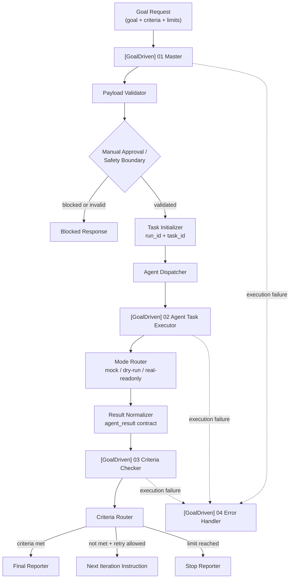

# Auto Agent Factory

**A mock-first, goal-driven n8n workflow skeleton for bounded, testable, and human-reviewable AI Agent automation.**

Technical positioning: **Goal-Driven Agent Workflow with n8n**.

**Language:** English | [简体中文](README.zh-CN.md)


Auto Agent Factory is a **mock-first AI Agent workflow skeleton** built with n8n. It turns an agent request into a bounded workflow contract: define a goal, define success criteria, run a controlled executor step, check the result, and decide whether to finish, revise, stop, or require human review.

Current stage: **v0.3.0 / Mock-First MVP Validation**. The project has validated `mock`, `dry-run`, and `real-readonly` stub routing, plus invalid payload blocking and high-risk manual review blocking. It is designed to prove orchestration, contracts, validation, and safety boundaries before connecting real providers.

This is **not** a production autonomous agent. It does **not** yet execute real LLM calls, real Codex/coding-agent tasks, shell commands, file writes, Git modifications, external write actions, or live SaaS user workflows.

Next phase: **V0.4 real provider adapter design**, read-only first. The next provider step is to design a controlled real-readonly adapter contract before enabling any real provider calls.

## Current Stage

| Area | v0.3.0 status |
|---|---|
| Project phase | Mock-First MVP Validation |
| Master workflow | Importable n8n workflow JSON implemented |
| Executor workflow | `mock`, `dry-run`, and `real-readonly` stub routing validated |
| Criteria checker | Provider-agnostic criteria evaluation workflow implemented |
| Error handler | n8n Error Trigger workflow implemented |
| Payload safety | Invalid payload validation and high-risk blocking verified |
| Local verification | Tests, workflow validation, dry-run, and import checks available |
| Real LLM provider | Not connected |
| Real Codex provider | Not connected |
| Production autonomous execution | Not implemented |
| Real user data / SaaS operations | Not included |

## Verified Paths

- `mock`: returns a controlled mock executor result for contract validation.
- `dry-run`: exercises routing and response shape without real provider calls.
- `real-readonly`: currently a stub route used to validate future adapter shape.
- invalid payload: blocked before executor dispatch.
- high-risk request: routed to manual review / blocking behavior.
- workflow validation: all exported workflow JSON files can be checked locally.
- import readiness: workflow import order and binding reminders are documented and checked.

## Safety Status

- Workflows are exported inactive by default.
- No real API keys or webhook secrets are stored in workflow JSON.
- `.env.example` contains placeholder variable names only.
- Execution is bounded by documented `max_iterations` and `timeout_minutes`.
- High-risk requests are blocked or require human review.
- The current executor does not perform shell execution, file writes, Git operations, or external write actions.
- Real provider integration is intentionally deferred behind future adapter and credential boundaries.

## Why This Project Exists

Many AI agent demos jump directly from a prompt to an automation. In real products, the harder problem is the control plane around the agent:

- What exact goal is the system trying to satisfy?
- What criteria define success?
- How does the workflow stop?
- What happens when output is invalid or incomplete?
- Where does human review happen for high-risk actions?
- How can the workflow be tested, imported, reviewed, and versioned as code?

Auto Agent Factory treats these as workflow architecture problems. The goal is to create a reusable skeleton for safer agent orchestration before adding expensive or risky provider integrations.

## What It Does

- Accepts a structured goal request with `goal`, `criteria`, and execution limits.
- Validates payloads before dispatching work.
- Routes high-risk requests through a manual review boundary.
- Initializes run and task identifiers.
- Dispatches one bounded executor iteration.
- Normalizes executor output into an `agent_result` contract.
- Checks evidence against acceptance criteria.
- Returns a final report, next iteration instruction, stop response, blocked response, or error context.
- Keeps workflow JSON, examples, tests, validation scripts, and operations docs in Git.

## Why Star This Project?

Star this repository if you want to follow or reuse:

- a goal-driven n8n workflow pattern for AI Agent automation
- mock-first validation before real provider cost and risk
- explicit success criteria instead of vague “agent finished” claims
- human-reviewable safety boundaries for high-risk actions
- workflow JSON managed and tested as code
- a practical roadmap toward real LLM adapters, Codex/coding-agent adapters, run history, and observability

## Architecture



## Workflow Modules

| Module | File | Responsibility | Current status |
|---|---|---|---|
| Goal-Driven Master Workflow | `workflows/goal_driven_master.workflow.json` | Receives goal payloads, validates input, initializes run/task IDs, dispatches executor/checker, routes final response. | Implemented |
| Agent Task Executor Workflow | `workflows/agent_task_executor.workflow.json` | Executes one bounded task iteration and returns a normalized `agent_result`. | Implemented with `mock`, `dry-run`, and `real-readonly` stub modes |
| Criteria Checker Workflow | `workflows/criteria_checker.workflow.json` | Evaluates executor evidence against criteria and returns pass/fail/unknown checks. | Implemented |
| Goal-Driven Error Handler Workflow | `workflows/error_handler.workflow.json` | Handles failed workflow executions and produces recovery context. | Implemented |

## Quick Start

Install dependencies:

```bash
npm install
```

Run tests:

```bash
npm test
```

Validate workflow JSON:

```bash
npm run workflow:validate:all
```

Run dry-run deployment check:

```bash
npm run workflow:dry-run
```

Check n8n import readiness:

```bash
npm run import:check
```

Optional smoke-test payload generation:

```bash
npm run smoke:goal-driven
```

## Import into n8n

Import the workflows in this order:

1. `[GoalDriven] 02 Agent Task Executor`  
   `workflows/agent_task_executor.workflow.json`
2. `[GoalDriven] 03 Criteria Checker`  
   `workflows/criteria_checker.workflow.json`
3. `[GoalDriven] 04 Error Handler`  
   `workflows/error_handler.workflow.json`
4. `[GoalDriven] 01 Master`  
   `workflows/goal_driven_master.workflow.json`

After importing, verify:

- workflows remain inactive by default
- Executor and Checker start with `When Executed by Another Workflow`
- Error Handler starts with `Error Trigger`
- Master sub-workflow bindings point to the correct Executor and Checker
- Master error workflow points to the Error Handler

Detailed guides:

- [`docs/IMPORT_ORDER.md`](docs/IMPORT_ORDER.md)
- [`docs/MANUAL_IMPORT_CHECKLIST.md`](docs/MANUAL_IMPORT_CHECKLIST.md)
- [`docs/RUNBOOK.md`](docs/RUNBOOK.md)
- [`docs/VALIDATION_LOG.md`](docs/VALIDATION_LOG.md)
- [`docs/V0_3A_REAL_READONLY_UI_VERIFICATION.md`](docs/V0_3A_REAL_READONLY_UI_VERIFICATION.md)

## Safety & Cost Boundaries

This project is intentionally not an unbounded autonomous agent.

Current boundaries:

- mock-first implementation
- dry-run execution path
- `real-readonly` is a stub, not a real provider call
- manual review gate for high-risk payloads
- `max_iterations` limit
- `timeout_minutes` limit
- workflow JSON exported as inactive by default
- no real API keys or secrets in workflow JSON
- `.env.example` contains placeholder names only
- no external write actions, shell execution, file writes, or Git modifications

Before connecting real providers, keep provider calls behind a backend, n8n credential, or adapter boundary. Do not expose OpenAI, ElevenLabs, n8n webhook secrets, or other credentials in frontend code or public workflow exports.

Related docs:

- [`docs/PRODUCTION_READINESS.md`](docs/PRODUCTION_READINESS.md)
- [`docs/REAL_PROVIDER_ADAPTER_DESIGN.md`](docs/REAL_PROVIDER_ADAPTER_DESIGN.md)
- [`docs/n8n-security-checklist.md`](docs/n8n-security-checklist.md)

## Project Status

Current release target: **v0.3.0 Mock-First MVP Validation**.

Implemented and validated:

- Four official n8n workflow JSON files in `workflows/`
- Workflow contract validation scripts
- Import readiness check script
- Dry-run deployment script
- Node test suite for schemas, scoring, and workflow contracts
- `goal`, `task`, and `result` JSON schemas
- Prompt templates for master, subagent, and criteria checker roles
- Sample goal, success result, failed result, and final report examples
- Manual test payloads for valid input, missing fields, high-risk approval, dry-run mode, and real-readonly stub mode
- Runbook, import order, manual import checklist, production readiness checklist, and real provider adapter design
- Mode Router regression fix and validation trail
- Safety documentation around `max_iterations`, `timeout_minutes`, manual review, and inactive workflow exports

Not implemented yet:

- real LLM execution
- real Codex/coding-agent automation
- real provider API calls
- persistent run history
- hosted dashboard
- multi-user permissions
- production autonomous execution
- real user data processing

## Roadmap

- Real LLM provider integration behind the existing adapter contract
- Codex / coding-agent executor adapter
- Persistent run history
- Web dashboard for monitoring executions
- Human approval UI
- Evaluation reports
- Multi-agent task routing
- RAG / knowledge base integration
- Better execution metrics and observability

These are planned milestones, not current capabilities.

## GitHub Display Assets

No real screenshots are included yet, and this README intentionally does not use fake screenshots.

Planned assets are tracked in [`docs/ASSETS_TODO.md`](docs/ASSETS_TODO.md), including:

- n8n master workflow screenshot
- executor workflow screenshot
- criteria checker workflow screenshot
- error handler screenshot
- sample execution output
- architecture diagram image

## Repository Structure

```text
.
├── README.md
├── README.zh-CN.md
├── CHANGELOG.md
├── LICENSE
├── docs/
│   ├── PROJECT_BRIEF.md
│   ├── PORTFOLIO_CASE_STUDY.md
│   ├── RUNBOOK.md
│   ├── IMPORT_ORDER.md
│   ├── MANUAL_IMPORT_CHECKLIST.md
│   ├── PRODUCTION_READINESS.md
│   ├── REAL_PROVIDER_ADAPTER_DESIGN.md
│   ├── RELEASE_NOTES_V0_3_0.md
│   └── ASSETS_TODO.md
├── workflows/
│   ├── goal_driven_master.workflow.json
│   ├── agent_task_executor.workflow.json
│   ├── criteria_checker.workflow.json
│   └── error_handler.workflow.json
├── examples/
│   ├── sample_goal_request.json
│   ├── sample_agent_result_success.json
│   ├── sample_agent_result_failed.json
│   ├── sample_final_report.md
│   └── manual-test-payloads/
├── src/
│   ├── schema/
│   ├── prompts/
│   └── utils/
├── tests/
├── scripts/
├── n8n/
├── .github/
├── .env.example
└── package.json
```

The `n8n/` directory contains an earlier Codex planner/reviewer workflow prototype kept as reference material. The current Auto Agent Factory v0.3.0 validation work lives primarily in `workflows/`, `docs/`, `examples/`, `src/`, and `tests/`.

## License

MIT. See [`LICENSE`](LICENSE).
