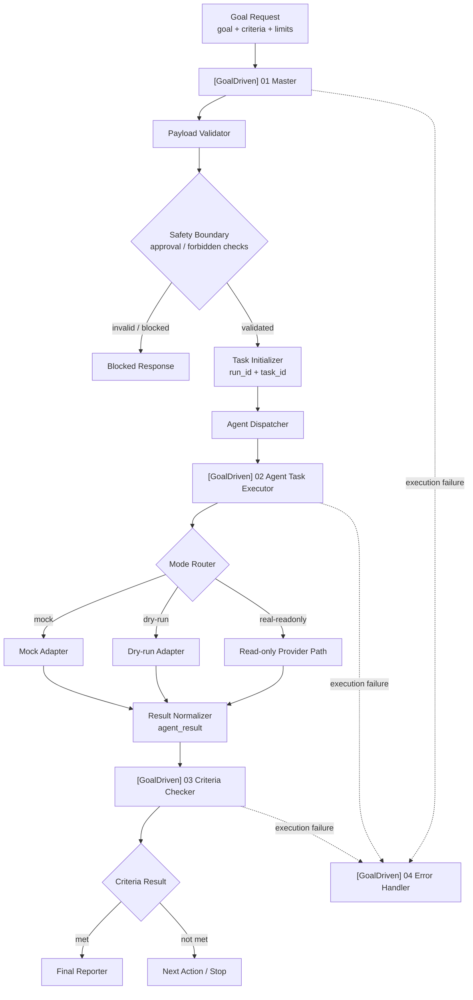

# Auto Agent Factory

**A local-first AI Agent governance toolkit for goal-driven n8n workflows.**

Auto Agent Factory helps developers prototype AI Agent workflows that are bounded, testable, auditable, and human-reviewable before any real write action is enabled. It turns an agent request into a structured control loop: define a goal, define success criteria, route execution safely, evaluate evidence, record an audit trail, and require human sign-off when risk appears.

This is not another “prompt goes in, automation happens” demo. It is a workflow governance skeleton for people who care about safety boundaries, reproducibility, and reviewable Agent execution.

**Language:** English | [简体中文](README.zh-CN.md)


## Why this exists

AI Agent systems fail less because the model cannot produce text, and more because the surrounding control plane is missing:

- unclear goals
- vague success criteria
- no bounded execution loop
- no evaluator contract
- no error recovery path
- no human approval boundary
- no audit trail that is safe to review
- no reproducible local demo path

Auto Agent Factory treats these as product and engineering problems, not prompt-writing problems.

## What you can do with it today

This repository currently supports three practical usage paths:

| Path | Requires API key? | Requires n8n runtime? | What it proves |
|---|---:|---:|---|
| Local demo path | No | No | replay a sanitized review cycle locally from sample data |
| n8n workflow path | No | Yes | import and validate the GoalDriven workflow skeleton in n8n |
| Real provider sandbox path | Yes, your own key in n8n Credentials | Yes | run a read-only provider sandbox that still returns `needs_review` |

Current capabilities include:

- four importable n8n workflow JSON files
- `mock`, `dry-run`, `real-readonly` stub, and read-only provider sandbox modes
- criteria checker alignment with criterion-indexed evidence
- high-risk approval gate and forbidden action rejection
- sanitized audit record schema and sanitizer
- audit review report generator
- human sign-off review package generator
- dev-only human decision ledger
- local end-to-end review cycle replay
- one-command local demo

## Quick start

Install dependencies:

```bash
npm install
```

Run the safest local demo path:

```bash
npm run demo:local
```

That command is repo-side only. It does not connect to n8n runtime, does not call a real provider, and does not require an API key. It may create dev-only artifacts under `.local-audit/`, which is ignored by Git.

Run the core validation path:

```bash
npm test
npm run workflow:validate:all
npm run workflow:dry-run
npm run import:check
```

Generate local review artifacts from sanitized sample records:

```bash
npm run audit:report
npm run audit:signoff
npm run audit:cycle:replay
```

## Architecture snapshot

| Layer | Purpose | Current proof point |
|---|---|---|
| GoalDriven Master | intake, payload validation, safety routing, executor/checker orchestration | importable inactive workflow JSON |
| Agent Task Executor | one bounded execution iteration | `mock`, `dry-run`, `real-readonly`, and read-only provider sandbox paths |
| Criteria Checker | evaluate evidence against criteria | criterion-indexed evidence contract validated |
| Error Handler | capture failed workflow executions | n8n Error Trigger workflow implemented |
| Safety boundary | prevent unsafe automation | high-risk approval gate and forbidden action rejection |
| Audit / sign-off | human-readable local review loop | sanitized record → report → sign-off → decision ledger → summary |



## Import into n8n

Import the workflows in this order:

1. `[GoalDriven] 02 Agent Task Executor` — `workflows/agent_task_executor.workflow.json`
2. `[GoalDriven] 03 Criteria Checker` — `workflows/criteria_checker.workflow.json`
3. `[GoalDriven] 04 Error Handler` — `workflows/error_handler.workflow.json`
4. `[GoalDriven] 01 Master` — `workflows/goal_driven_master.workflow.json`

After importing, verify sub-workflow bindings manually. Cross-instance n8n imports may require reselecting the Executor, Checker, and Error Handler workflows.

Useful docs:

- [`docs/IMPORT_ORDER.md`](docs/IMPORT_ORDER.md)
- [`docs/MANUAL_IMPORT_CHECKLIST.md`](docs/MANUAL_IMPORT_CHECKLIST.md)
- [`docs/RUNBOOK.md`](docs/RUNBOOK.md)
- [`docs/VALIDATION_LOG.md`](docs/VALIDATION_LOG.md)

## Real provider sandbox

The real provider path is intentionally read-only. It is designed to generate structured summary, intended actions, evidence, and risk context. It must still return review-oriented output and keep human approval boundaries intact.

To try this path, use your own local n8n instance and your own provider key stored in n8n Credentials. Do not put provider keys in workflow JSON, docs, examples, prompts, or Git.

See:

- [`docs/V0.5_SANDBOX_MANUAL_SETUP_CHECKLIST.md`](docs/V0.5_SANDBOX_MANUAL_SETUP_CHECKLIST.md)
- [`docs/ADR_0001_REAL_READONLY_PROVIDER_SELECTION.md`](docs/ADR_0001_REAL_READONLY_PROVIDER_SELECTION.md)
- [`docs/REAL_PROVIDER_ADAPTER_DESIGN.md`](docs/REAL_PROVIDER_ADAPTER_DESIGN.md)

## Safety boundaries

Auto Agent Factory is deliberately conservative:

- workflows are exported inactive by default
- no API keys in workflow JSON
- no `.env` files committed
- no `.local-audit/` artifacts committed
- no credential plaintext in docs or examples
- no raw provider responses stored in repo fixtures
- no full prompt/message payloads stored in audit records
- no shell execution
- no Git modification
- no file-write workflow action
- no external write action
- no production database or hosted user system
- no production autonomous Agent execution

Before sharing changes, check that the diff does not contain:

```text
Bearer <secret>
real API keys
.env
credential plaintext
.local-audit/
provider raw response
full prompt / messages
```

## What this is not

This project is not:

- a SaaS product
- a multi-user production approval system
- a production autonomous coding agent
- a replacement for n8n security configuration
- a workflow that can safely write to files, Git, shells, or external systems by default
- a place to store provider keys or private user data

It is an open-source, local-first toolkit for learning, validating, and extending safer Agent workflow patterns.

## Repository structure

```text
workflows/              n8n workflow JSON exports
docs/                   architecture, runbooks, safety docs, release notes
examples/               safe sample payloads and sanitized fixtures
src/schema/             JSON schemas for workflow and audit contracts
src/utils/              validation, scoring, sanitizer, report utilities
scripts/                validation, import checks, demo and audit CLIs
tests/                  Node test suite
.local-audit/           dev-only generated artifacts, ignored by Git
```

## Documentation map

Start here:

- [`docs/LOCAL_DEMO_RUNBOOK.md`](docs/LOCAL_DEMO_RUNBOOK.md) — fastest safe local demo path
- [`docs/WORKFLOW_DESIGN.md`](docs/WORKFLOW_DESIGN.md) — workflow architecture and module responsibilities
- [`docs/MILESTONE_SUMMARY.md`](docs/MILESTONE_SUMMARY.md) — project evolution and current proof points
- [`docs/RELEASE_NOTES_V1_0_RC.md`](docs/RELEASE_NOTES_V1_0_RC.md) — v1.0 release-candidate notes
- [`docs/README.md`](docs/README.md) — full documentation index

Open-source process:

- [`CONTRIBUTING.md`](CONTRIBUTING.md)
- [`SECURITY.md`](SECURITY.md)
- [`LICENSE`](LICENSE)
- [`docs/OPEN_SOURCE_RELEASE_CHECKLIST.md`](docs/OPEN_SOURCE_RELEASE_CHECKLIST.md)

## Roadmap

Near-term:

- stabilize v1.0 release-candidate docs and local demo path
- keep real provider usage read-only first
- improve screenshots or diagrams only when they reflect real repository state
- expand evaluator quality tests for ambiguous evidence

Later:

- optional provider adapters behind the same `agent_result` contract
- Codex / coding-agent executor adapter behind explicit human approval
- production-grade persistence design, if needed
- hosted dashboard or approval UI, if the project grows beyond local-first usage
- multi-agent task routing and RAG / knowledge-base adapters

Planned items are not current capabilities.

## License

MIT. See [`LICENSE`](LICENSE).
