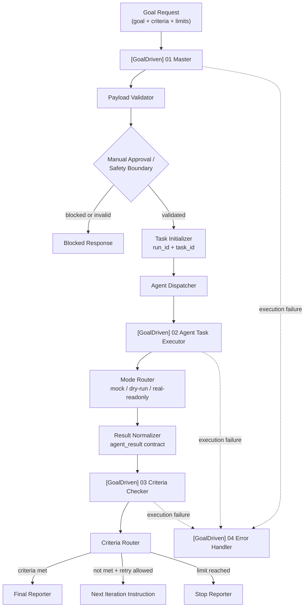

# Goal-Driven Agent Workflow with n8n

**Language:** English | [简体中文](README.zh-CN.md)


A **goal-driven AI Agent workflow MVP** built with n8n.

This project turns an Agent task from “let the model try something” into a bounded workflow with a goal, criteria, execution loop, result checking, error handling, and human approval gates. It separates orchestration into four importable n8n workflows and validates the system with mock-first contracts before connecting any real provider.

Current status: **mock-first MVP validated**, with dry-run and real-readonly stub modes available in the executor. No real LLM, Codex, or external provider is connected in this repository.

## Overview

`Goal-Driven Agent Workflow with n8n` is a workflow-as-code prototype for building safer Agent automation.

Instead of treating an Agent as a single prompt or a black-box automation, the project models an execution system around:

- a user-defined `goal`
- explicit `criteria`
- a bounded executor workflow
- a criteria checker
- an error workflow
- manual approval and stop conditions
- import, validation, and rollback documentation

The repository is designed to be reproducible: workflow JSON lives in Git, sample payloads live in `examples/`, validation scripts live in `scripts/`, and operational guidance lives in `docs/`.

## The Problem

Many Agent automation demos fail for the same reasons:

- the goal is ambiguous
- success criteria are not measurable
- outputs are not checked against acceptance criteria
- failures do not have a recovery path
- costs and execution time can grow without a stop condition
- high-risk actions may continue without human review

This project treats those issues as product and systems-design problems, not just prompt-engineering problems.

## Product Concept

The core product assumption is simple:

> A user submits a `goal` and a list of `criteria`. The Master Workflow initializes a run, dispatches an executor, checks the result against the criteria, and either finishes, asks for another iteration, blocks for human approval, or routes failures to an Error Handler.

The MVP is intentionally mock-first. It proves the workflow contract, import path, validation scripts, safety boundaries, and manual testing process before connecting a real provider.

## Architecture



## Workflow Modules

| Module | File | Responsibility | Current Status | Notes |
|---|---|---|---|---|
| Goal-Driven Master Workflow | `workflows/goal_driven_master.workflow.json` | Receives goal payloads, validates input, initializes run/task IDs, dispatches executor/checker, routes final response. | Implemented as importable workflow JSON. | Includes human approval and safety gate behavior. |
| Agent Task Executor Workflow | `workflows/agent_task_executor.workflow.json` | Executes one bounded task iteration and returns a normalized `agent_result`. | Implemented with `mock`, `dry-run`, and `real-readonly` stub modes. | No real provider is connected. |
| Criteria Checker Workflow | `workflows/criteria_checker.workflow.json` | Evaluates executor evidence against each criterion and returns pass/fail/unknown checks. | Implemented as sub-workflow. | Designed to be provider-agnostic. |
| Goal-Driven Error Handler Workflow | `workflows/error_handler.workflow.json` | Handles failed workflow executions and produces recovery context. | Implemented as Error Trigger workflow. | Error Handler verification is documented in the Runbook. |

## What is already implemented

Verified against the current repository:

- Four official n8n workflow JSON files in `workflows/`
- Workflow contract validation scripts
- Import readiness check script
- Dry-run deployment script that does not call the n8n API unless explicitly configured
- Node test suite covering schemas, criteria scoring, and workflow contracts
- `goal`, `task`, and `result` JSON schemas
- Prompt templates for master, subagent, and criteria checker roles
- Sample goal, success result, failed result, and final report examples
- Manual test payloads for valid input, missing fields, high-risk approval, dry-run mode, and real-readonly stub mode
- Runbook, import order, manual import checklist, production readiness checklist, and real provider adapter design
- Mock-first execution path
- Safety defaults and documentation around `max_iterations`, `timeout_minutes`, manual approval, and inactive workflow exports

Documented validation status:

- mock-first MVP validated
- Production Webhook smoke test passed in the local n8n validation flow
- Error Workflow verified through automatic failure triggering
- Human Approval Gate verified with high-risk payload behavior
- `workflow:validate:all` currently expected to report `0 warning / 0 error`

## Quick Start

Install dependencies:

```bash
npm install
```

Run the local test suite:

```bash
npm test
```

Validate all workflow JSON files:

```bash
npm run workflow:validate:all
```

Run the deployment script in dry-run mode:

```bash
npm run workflow:dry-run
```

Check import readiness:

```bash
npm run import:check
```

Optional: generate a smoke-test request from the sample goal payload:

```bash
npm run smoke:goal-driven
```

## Import into n8n

Import the workflows in this order:

1. `[GoalDriven] 02 Agent Task Executor`  
   `workflows/agent_task_executor.workflow.json`
2. `[GoalDriven] 03 Criteria Checker`  
   `workflows/criteria_checker.workflow.json`
3. `[GoalDriven] 04 Error Handler`  
   `workflows/error_handler.workflow.json`
4. `[GoalDriven] 01 Master`  
   `workflows/goal_driven_master.workflow.json`

After importing, verify:

- workflows remain inactive by default
- Executor and Checker start with `When Executed by Another Workflow`
- Error Handler starts with `Error Trigger`
- Master sub-workflow bindings point to the correct Executor and Checker
- Master error workflow points to the Error Handler

Detailed guides:

- [`docs/IMPORT_ORDER.md`](docs/IMPORT_ORDER.md)
- [`docs/MANUAL_IMPORT_CHECKLIST.md`](docs/MANUAL_IMPORT_CHECKLIST.md)
- [`docs/RUNBOOK.md`](docs/RUNBOOK.md)

## Manual Testing

Start with:

```text
examples/sample_goal_request.json
```

Additional manual payloads:

```text
examples/manual-test-payloads/01-valid-goal.json
examples/manual-test-payloads/02-missing-goal.json
examples/manual-test-payloads/03-missing-criteria.json
examples/manual-test-payloads/04-high-risk-needs-approval.json
examples/manual-test-payloads/05-dry-run-mode.json
examples/manual-test-payloads/06-real-readonly-mode.json
```

Expected checks during manual execution:

- `run_id` is generated
- `task_id` is generated
- `criteria_result` is returned
- `next_action` is returned
- missing `goal` returns a clear validation error
- missing `criteria` returns a clear validation error
- high-risk payloads can be blocked by the manual approval gate
- Error Handler behavior is verified through automatic execution failure, not only manual test execution

## Safety & Cost Boundaries

This project is intentionally not an unbounded autonomous Agent implementation.

Safety boundaries include:

- mock-first implementation
- dry-run execution path
- real-readonly stub before real provider integration
- manual approval gate for high-risk payloads
- `max_iterations` limit
- `timeout_minutes` limit
- workflow JSON exported as inactive by default
- no real secrets in workflow JSON
- no production activation before manual verification
- `.env.example` contains variable names only, not real values

Before any real provider work, I keep the implementation behind the same readiness and adapter boundaries:

- [`docs/PRODUCTION_READINESS.md`](docs/PRODUCTION_READINESS.md)
- [`docs/REAL_PROVIDER_ADAPTER_DESIGN.md`](docs/REAL_PROVIDER_ADAPTER_DESIGN.md)

## Roadmap

The next direction is to keep the current workflow contract stable while gradually replacing stubs with controlled provider adapters:

- Real LLM provider integration behind the existing adapter contract
- Codex / coding-agent executor adapter
- Persistent run history
- Web dashboard for monitoring executions
- Human approval UI
- Evaluation reports
- Multi-agent task routing
- RAG / knowledge base integration
- Better execution metrics and observability

I keep these as next steps, not as current capabilities.

## Repository Structure

```text
.
├── README.md
├── README.zh-CN.md
├── docs/
│   ├── PROJECT_BRIEF.md
│   ├── PORTFOLIO_CASE_STUDY.md
│   ├── RUNBOOK.md
│   ├── IMPORT_ORDER.md
│   ├── MANUAL_IMPORT_CHECKLIST.md
│   ├── PRODUCTION_READINESS.md
│   └── REAL_PROVIDER_ADAPTER_DESIGN.md
├── workflows/
│   ├── goal_driven_master.workflow.json
│   ├── agent_task_executor.workflow.json
│   ├── criteria_checker.workflow.json
│   └── error_handler.workflow.json
├── examples/
│   ├── sample_goal_request.json
│   ├── sample_agent_result_success.json
│   ├── sample_agent_result_failed.json
│   ├── sample_final_report.md
│   └── manual-test-payloads/
├── src/
│   ├── schema/
│   ├── prompts/
│   └── utils/
├── tests/
├── scripts/
├── n8n/
├── .env.example
└── package.json
```

The `n8n/` directory contains an earlier Codex planner/reviewer workflow prototype kept as reference material. The current GoalDriven MVP lives primarily in `workflows/`, `docs/`, `examples/`, `src/`, and `tests/`.

## Why I built this

I built this project to make Agent workflow design more concrete. The interesting part is not only calling a model; it is defining the control system around the model:

- goal decomposition before execution
- criteria-based validation instead of vague completion claims
- workflow orchestration across dedicated modules
- fail-safe error handling
- human-in-the-loop safety
- mock-first engineering before real provider integration
- import-ready n8n workflow JSON managed as code
- documentation for validation, migration, rollback, and future provider adapters

For me, this project is a practical way to show how Agent products can be designed with contracts, safety boundaries, and operational discipline from the start.

## Project status

- MVP status: mock-first workflow validated
- Real provider: not connected yet
