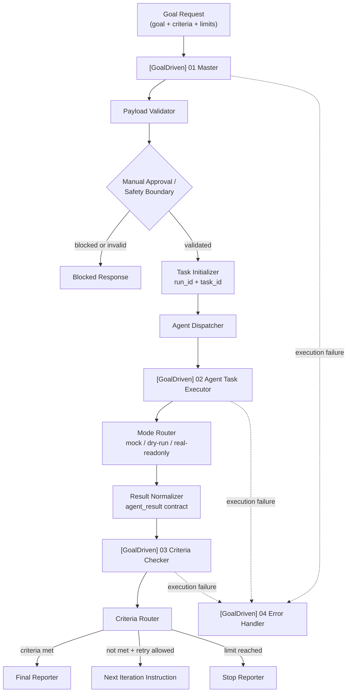

# Auto Agent Factory

**一个 mock-first、目标驱动的 n8n workflow skeleton，用于构建有边界、可测试、可人工审核的 AI Agent 自动化。**

技术定位：**Goal-Driven Agent Workflow with n8n**。

**语言：** [English](README.md) | 简体中文


Auto Agent Factory 是一个基于 **n8n** 的 **mock-first AI Agent workflow skeleton**。它把一次 Agent 请求变成一个有边界的 workflow contract：定义目标、定义成功标准、执行一轮受控任务、检查结果，然后决定完成、修订、停止，或进入人工审核。

当前阶段：**v0.3.0 / Mock-First MVP Validation**。项目已验证 `mock`、`dry-run`、`real-readonly` stub 三条路由，同时验证了 invalid payload 阻断和 high-risk 人工审核阻断。当前重点是先证明编排结构、contract、验证流程和安全边界，再接入真实 provider。

这不是生产自主执行 Agent。它目前**不会**执行真实 LLM 调用、真实 Codex/coding-agent 任务、shell 命令、文件写入、Git 修改、外部写操作或真实 SaaS 用户流程。

## Current Stage

| Area | v0.3.0 status |
|---|---|
| 项目阶段 | Mock-First MVP Validation |
| Master workflow | 已实现为可导入 n8n workflow JSON |
| Executor workflow | 已验证 `mock`、`dry-run`、`real-readonly` stub 路由 |
| Criteria checker | 已实现 provider-agnostic 的 criteria evaluation workflow |
| Error handler | 已实现 n8n Error Trigger workflow |
| Payload safety | 已验证 invalid payload 校验和 high-risk 阻断 |
| 本地验证 | 已提供 tests、workflow validation、dry-run、import check |
| 真实 LLM provider | 未接入 |
| 真实 Codex provider | 未接入 |
| 生产自主执行 | 未实现 |
| 真实用户数据 / SaaS 运行 | 未包含 |

## Verified Paths

- `mock`：返回受控 mock executor result，用于验证 contract。
- `dry-run`：验证路由和响应结构，不调用真实 provider。
- `real-readonly`：当前是 stub route，用于验证未来 adapter 形态。
- invalid payload：在派发 Executor 前阻断。
- high-risk request：进入人工审核 / 阻断行为。
- workflow validation：可在本地检查所有导出的 workflow JSON。
- import readiness：已文档化并可检查 workflow 导入顺序和绑定提醒。

## Safety Status

- workflow 导出默认 inactive。
- workflow JSON 中没有真实 API key 或 webhook secret。
- `.env.example` 只包含 placeholder 变量名。
- 执行边界由 `max_iterations` 和 `timeout_minutes` 约束。
- high-risk 请求会被阻断或要求人工审核。
- 当前 Executor 不执行 shell、文件写入、Git 操作或外部写操作。
- 真实 provider 接入会放在未来 adapter 和 credential 边界之后。

## Why This Project Exists

很多 AI Agent demo 会直接从 prompt 跳到自动化执行。但在真实产品里，更难的是 Agent 外围的控制平面：

- 系统到底要完成什么目标？
- 什么标准算成功？
- workflow 如何停止？
- 输出无效或不完整时怎么办？
- 高风险动作在哪里进入人工审核？
- workflow 如何被测试、导入、review，并以代码方式版本管理？

Auto Agent Factory 把这些问题当成 workflow architecture 问题。这个项目的目标是先做出一个更安全、可复用的 Agent orchestration skeleton，再逐步加入高成本或高风险的 provider integration。

## What It Does

- 接收包含 `goal`、`criteria` 和执行限制的结构化 goal request。
- 在派发任务前校验 payload。
- 将 high-risk 请求路由到人工审核边界。
- 初始化 run 和 task 标识。
- 派发一轮有边界的 executor iteration。
- 将 executor 输出标准化为 `agent_result` contract。
- 根据 acceptance criteria 检查 evidence。
- 返回 final report、next iteration instruction、stop response、blocked response 或 error context。
- 将 workflow JSON、examples、tests、validation scripts 和运行文档保存在 Git 中。

## Why Star This Project?

如果你关注以下方向，可以 Star 这个仓库：

- 基于 n8n 的 goal-driven AI Agent workflow pattern
- 在真实 provider 成本和风险之前先做 mock-first validation
- 用明确 criteria 取代模糊的“Agent 已完成”说法
- 面向 high-risk action 的 human-reviewable safety boundary
- 将 workflow JSON 当作代码管理和测试
- 后续真实 LLM adapter、Codex/coding-agent adapter、run history 和 observability 的实践路线

## Architecture



## Workflow Modules

| Module | File | Responsibility | Current status |
|---|---|---|---|
| Goal-Driven Master Workflow | `workflows/goal_driven_master.workflow.json` | 接收 goal payload、校验输入、初始化 run/task ID、调度 Executor 和 Checker、返回最终响应。 | 已实现 |
| Agent Task Executor Workflow | `workflows/agent_task_executor.workflow.json` | 执行一轮有边界的任务，并返回标准化 `agent_result`。 | 已实现 `mock`、`dry-run`、`real-readonly` stub modes |
| Criteria Checker Workflow | `workflows/criteria_checker.workflow.json` | 根据 criteria 评估 executor evidence，返回 pass/fail/unknown checks。 | 已实现 |
| Goal-Driven Error Handler Workflow | `workflows/error_handler.workflow.json` | 处理失败的 workflow execution 并输出恢复上下文。 | 已实现 |

## Quick Start

安装依赖：

```bash
npm install
```

运行测试：

```bash
npm test
```

校验 workflow JSON：

```bash
npm run workflow:validate:all
```

运行 dry-run 部署检查：

```bash
npm run workflow:dry-run
```

检查 n8n import readiness：

```bash
npm run import:check
```

可选：生成 smoke-test payload：

```bash
npm run smoke:goal-driven
```

## Import into n8n

建议按以下顺序导入：

1. `[GoalDriven] 02 Agent Task Executor`  
   `workflows/agent_task_executor.workflow.json`
2. `[GoalDriven] 03 Criteria Checker`  
   `workflows/criteria_checker.workflow.json`
3. `[GoalDriven] 04 Error Handler`  
   `workflows/error_handler.workflow.json`
4. `[GoalDriven] 01 Master`  
   `workflows/goal_driven_master.workflow.json`

导入后请确认：

- workflows 默认保持 inactive
- Executor 和 Checker 以 `When Executed by Another Workflow` 开头
- Error Handler 以 `Error Trigger` 开头
- Master 的 sub-workflow bindings 指向正确的 Executor 和 Checker
- Master 的 error workflow 指向 Error Handler

详细说明：

- [`docs/IMPORT_ORDER.md`](docs/IMPORT_ORDER.md)
- [`docs/MANUAL_IMPORT_CHECKLIST.md`](docs/MANUAL_IMPORT_CHECKLIST.md)
- [`docs/RUNBOOK.md`](docs/RUNBOOK.md)
- [`docs/VALIDATION_LOG.md`](docs/VALIDATION_LOG.md)
- [`docs/V0_3A_REAL_READONLY_UI_VERIFICATION.md`](docs/V0_3A_REAL_READONLY_UI_VERIFICATION.md)

## Safety & Cost Boundaries

这个项目有意不做无边界自治 Agent。

当前边界：

- mock-first 实现
- dry-run 执行路径
- `real-readonly` 是 stub，不是真实 provider call
- high-risk payload 的人工审核门
- `max_iterations` 限制
- `timeout_minutes` 限制
- workflow JSON 导出默认 inactive
- workflow JSON 中没有真实 API keys 或 secrets
- `.env.example` 只包含 placeholder 变量名
- 不执行外部写操作、shell、文件写入或 Git 修改

接入真实 provider 前，应将 provider call 放在 backend、n8n credential 或 adapter 边界之后。不要在 frontend code 或公开 workflow export 中暴露 OpenAI、ElevenLabs、n8n webhook secrets 或其他 credentials。

相关文档：

- [`docs/PRODUCTION_READINESS.md`](docs/PRODUCTION_READINESS.md)
- [`docs/REAL_PROVIDER_ADAPTER_DESIGN.md`](docs/REAL_PROVIDER_ADAPTER_DESIGN.md)
- [`docs/n8n-security-checklist.md`](docs/n8n-security-checklist.md)

## Project Status

当前发布目标：**v0.3.0 Mock-First MVP Validation**。

已实现并验证：

- `workflows/` 中的 4 个正式 n8n workflow JSON
- workflow contract validation scripts
- import readiness check script
- dry-run deployment script
- Node test suite，覆盖 schemas、scoring、workflow contracts
- `goal`、`task`、`result` JSON schemas
- master、subagent、criteria checker prompt templates
- sample goal、success result、failed result 和 final report examples
- valid input、missing fields、high-risk approval、dry-run mode、real-readonly stub mode 的 manual test payloads
- Runbook、import order、manual import checklist、production readiness checklist、real provider adapter design
- Mode Router regression fix 和 validation trail
- 围绕 `max_iterations`、`timeout_minutes`、manual review、inactive workflow exports 的 safety documentation

尚未实现：

- 真实 LLM execution
- 真实 Codex/coding-agent automation
- 真实 provider API calls
- persistent run history
- hosted dashboard
- multi-user permissions
- 生产自主执行
- 真实用户数据处理

## Roadmap

- 在现有 adapter contract 后接入真实 LLM provider
- Codex / coding-agent executor adapter
- Persistent run history
- Web dashboard for monitoring executions
- Human approval UI
- Evaluation reports
- Multi-agent task routing
- RAG / knowledge base integration
- 更完整的 execution metrics 和 observability

这些是计划中的里程碑，不是当前能力。

## GitHub Display Assets

当前还没有真实截图，本 README 不使用伪造截图。

计划补充的素材记录在 [`docs/ASSETS_TODO.md`](docs/ASSETS_TODO.md)，包括：

- n8n master workflow screenshot
- executor workflow screenshot
- criteria checker workflow screenshot
- error handler screenshot
- sample execution output
- architecture diagram image

## Repository Structure

```text
.
├── README.md
├── README.zh-CN.md
├── CHANGELOG.md
├── LICENSE
├── docs/
│   ├── PROJECT_BRIEF.md
│   ├── PORTFOLIO_CASE_STUDY.md
│   ├── RUNBOOK.md
│   ├── IMPORT_ORDER.md
│   ├── MANUAL_IMPORT_CHECKLIST.md
│   ├── PRODUCTION_READINESS.md
│   ├── REAL_PROVIDER_ADAPTER_DESIGN.md
│   ├── RELEASE_NOTES_V0_3_0.md
│   └── ASSETS_TODO.md
├── workflows/
│   ├── goal_driven_master.workflow.json
│   ├── agent_task_executor.workflow.json
│   ├── criteria_checker.workflow.json
│   └── error_handler.workflow.json
├── examples/
│   ├── sample_goal_request.json
│   ├── sample_agent_result_success.json
│   ├── sample_agent_result_failed.json
│   ├── sample_final_report.md
│   └── manual-test-payloads/
├── src/
│   ├── schema/
│   ├── prompts/
│   └── utils/
├── tests/
├── scripts/
├── n8n/
├── .github/
├── .env.example
└── package.json
```

`n8n/` 目录保留了早期 Codex planner/reviewer workflow prototype，作为参考材料。当前 Auto Agent Factory v0.3.0 validation 工作主要位于 `workflows/`、`docs/`、`examples/`、`src/` 和 `tests/`。

## License

MIT. See [`LICENSE`](LICENSE).
