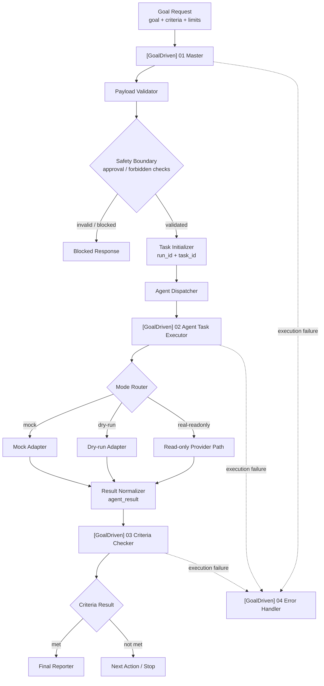

# Auto Agent Factory

**一个 local-first 的 AI Agent governance toolkit，用于构建目标驱动的 n8n workflow。**

Auto Agent Factory 帮助开发者在启用任何真实写操作之前，先验证一个有边界、可测试、可审计、可人工审核的 AI Agent workflow。它把一次 Agent 请求变成结构化控制闭环：定义目标、定义成功标准、安全路由执行、评估 evidence、记录审计轨迹，并在风险出现时要求人工 sign-off。

这不是“输入 prompt，Agent 自动乱跑”的 demo。它更像一个 Agent workflow 的治理骨架：先把安全边界、可复现验证和人工审核路径做好，再考虑接入更高风险的执行能力。

**语言：** [English](README.md) | 简体中文


## 为什么做这个项目

AI Agent 系统真正容易失控的地方，往往不是模型不会生成内容，而是模型外面的控制平面缺失：

- 目标不清楚
- 成功标准不明确
- 没有有边界的执行循环
- 没有稳定 evaluator contract
- 没有错误恢复路径
- 没有人工审核边界
- 没有安全可读的 audit trail
- 没有可复现的本地 demo 路径

Auto Agent Factory 把这些问题当成产品和工程问题，而不是单纯 prompt 问题。

## 现在可以做什么

当前仓库支持三条使用路径：

| 路径 | 需要 API key？ | 需要 n8n runtime？ | 验证什么 |
|---|---:|---:|---|
| 本地 demo path | 不需要 | 不需要 | 使用 sample data 本地回放 sanitized review cycle |
| n8n workflow path | 不需要 | 需要 | 导入并验证 GoalDriven workflow skeleton |
| real provider sandbox path | 需要，放在你自己的 n8n Credentials 中 | 需要 | 运行 read-only provider sandbox，输出仍然 `needs_review` |

当前能力包括：

- 4 个可导入的 n8n workflow JSON
- `mock`、`dry-run`、`real-readonly` stub 和 read-only provider sandbox 模式
- 基于 criterion-indexed evidence 的 Criteria Checker 对齐
- high-risk approval gate 和 forbidden action rejection
- sanitized audit record schema / sanitizer
- audit review report generator
- human sign-off review package generator
- dev-only human decision ledger
- 本地端到端 review cycle replay
- 一条命令运行本地 demo

## Quick Start

安装依赖：

```bash
npm install
```

运行最安全的本地 demo：

```bash
npm run demo:local
```

这个命令只在仓库本地运行。它不会连接 n8n runtime，不会调用真实 provider，也不需要 API key。它可能在 `.local-audit/` 下生成 dev-only artifact，该目录已被 Git 忽略。

运行核心校验：

```bash
npm test
npm run workflow:validate:all
npm run workflow:dry-run
npm run import:check
```

基于 sanitized sample record 生成本地 review artifact：

```bash
npm run audit:report
npm run audit:signoff
npm run audit:cycle:replay
```

## Architecture Snapshot

| 层 | 作用 | 当前验证点 |
|---|---|---|
| GoalDriven Master | intake、payload validation、安全路由、Executor/Checker 编排 | 可导入的 inactive workflow JSON |
| Agent Task Executor | 一轮有边界的执行 iteration | `mock`、`dry-run`、`real-readonly`、read-only provider sandbox |
| Criteria Checker | 根据 criteria 评估 evidence | 已验证 criterion-indexed evidence contract |
| Error Handler | 捕获失败 workflow execution | 已实现 n8n Error Trigger workflow |
| Safety boundary | 防止不安全自动化 | high-risk approval gate 和 forbidden action rejection |
| Audit / sign-off | 本地可读人工审核闭环 | sanitized record → report → sign-off → decision ledger → summary |



## 导入 n8n

按这个顺序导入 workflow：

1. `[GoalDriven] 02 Agent Task Executor` — `workflows/agent_task_executor.workflow.json`
2. `[GoalDriven] 03 Criteria Checker` — `workflows/criteria_checker.workflow.json`
3. `[GoalDriven] 04 Error Handler` — `workflows/error_handler.workflow.json`
4. `[GoalDriven] 01 Master` — `workflows/goal_driven_master.workflow.json`

导入后需要人工确认 sub-workflow bindings。跨 n8n 实例导入时，可能需要重新选择 Executor、Checker 和 Error Handler。

相关文档：

- [`docs/IMPORT_ORDER.md`](docs/IMPORT_ORDER.md)
- [`docs/MANUAL_IMPORT_CHECKLIST.md`](docs/MANUAL_IMPORT_CHECKLIST.md)
- [`docs/RUNBOOK.md`](docs/RUNBOOK.md)
- [`docs/VALIDATION_LOG.md`](docs/VALIDATION_LOG.md)

## Real Provider Sandbox

真实 provider 路径当前保持 read-only。它用于生成结构化 summary、intended actions、evidence 和 risk context，但输出仍然面向 review，不会自动执行真实写操作。

如果要测试这条路径，请使用你自己的本地 n8n 和自己的 provider key，并把 key 放在 n8n Credentials 中。不要把 provider key 写进 workflow JSON、docs、examples、prompt 或 Git。

相关文档：

- [`docs/V0.5_SANDBOX_MANUAL_SETUP_CHECKLIST.md`](docs/V0.5_SANDBOX_MANUAL_SETUP_CHECKLIST.md)
- [`docs/ADR_0001_REAL_READONLY_PROVIDER_SELECTION.md`](docs/ADR_0001_REAL_READONLY_PROVIDER_SELECTION.md)
- [`docs/REAL_PROVIDER_ADAPTER_DESIGN.md`](docs/REAL_PROVIDER_ADAPTER_DESIGN.md)

## 安全边界

Auto Agent Factory 默认非常保守：

- workflow 导出默认 inactive
- workflow JSON 中不写 API key
- 不提交 `.env`
- 不提交 `.local-audit/`
- docs / examples 中不写 credential 明文
- repo fixture 中不保存 provider raw response
- audit record 中不保存完整 prompt / messages
- 不执行 shell
- 不修改 Git
- 不启用 workflow file write action
- 不启用 external write action
- 不启用 production database 或 hosted user system
- 不做 production autonomous Agent execution

提交前请检查 diff 中不要出现：

```text
Bearer <secret>
真实 API key
.env
credential 明文
.local-audit/
provider raw response
full prompt / messages
```

## 这个项目不是什么

它不是：

- SaaS 产品
- 多用户生产审批系统
- 生产级自治 coding agent
- n8n 安全配置的替代品
- 默认可以安全写文件、改 Git、跑 shell 或调用外部写接口的 workflow
- 存放 provider key 或私有用户数据的地方

它是一个 open-source、local-first 的工具包，用来学习、验证和扩展更安全的 Agent workflow pattern。

## 仓库结构

```text
workflows/              n8n workflow JSON exports
docs/                   architecture、runbook、安全文档、release notes
examples/               安全 sample payload 和 sanitized fixtures
src/schema/             workflow / audit contract JSON schemas
src/utils/              validation、scoring、sanitizer、report utilities
scripts/                validation、import checks、demo 和 audit CLIs
tests/                  Node test suite
.local-audit/           dev-only generated artifacts，已被 Git 忽略
```

## 文档入口

Start here：

- [`docs/LOCAL_DEMO_RUNBOOK.md`](docs/LOCAL_DEMO_RUNBOOK.md) — 最快的安全本地 demo 路径
- [`docs/WORKFLOW_DESIGN.md`](docs/WORKFLOW_DESIGN.md) — workflow 架构和模块职责
- [`docs/MILESTONE_SUMMARY.md`](docs/MILESTONE_SUMMARY.md) — 项目阶段和当前验证点
- [`docs/RELEASE_NOTES_V1_0_RC.md`](docs/RELEASE_NOTES_V1_0_RC.md) — v1.0 release-candidate notes
- [`docs/README.md`](docs/README.md) — 完整文档索引

开源协作：

- [`CONTRIBUTING.md`](CONTRIBUTING.md)
- [`SECURITY.md`](SECURITY.md)
- [`LICENSE`](LICENSE)
- [`docs/OPEN_SOURCE_RELEASE_CHECKLIST.md`](docs/OPEN_SOURCE_RELEASE_CHECKLIST.md)

## Roadmap

近期：

- 稳定 v1.0 release-candidate docs 和本地 demo path
- 继续保持 real provider read-only first
- 只有在截图真实反映当前仓库状态时才补充截图
- 增强 ambiguous evidence 的 evaluator quality tests

后续：

- 在同一个 `agent_result` contract 后增加可选 provider adapters
- 在显式人工审批之后再设计 Codex / coding-agent executor adapter
- 如有必要，再设计 production-grade persistence
- 如果项目超出 local-first 范围，再考虑 hosted dashboard / approval UI
- multi-agent task routing 和 RAG / knowledge-base adapters

Roadmap 是规划，不是当前能力。

## License

MIT。见 [`LICENSE`](LICENSE)。
