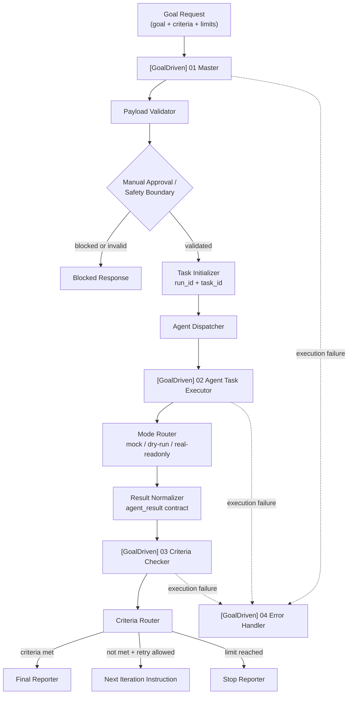

# Goal-Driven Agent Workflow with n8n

**语言：** [English](README.md) | 简体中文


一个基于 **n8n** 构建的 **目标驱动型 AI Agent 工作流 MVP**。

这个项目不是“让模型随便执行一个任务”，而是把 Agent 任务拆成一个有边界的工作流：目标定义、成功标准、执行循环、结果检查、错误处理和人工审核。项目将编排拆成 4 个可导入的 n8n workflow，并在接入真实 provider 之前，先用 mock-first contract 验证结构、安全边界和可复现性。

当前状态：**mock-first MVP 已验证**。Executor 已支持 dry-run 和 real-readonly stub 模式。本仓库尚未接入真实 LLM、Codex 或外部 provider。

## Overview

`Goal-Driven Agent Workflow with n8n` 是一个 workflow-as-code 原型，用来探索更安全、可验证的 Agent 自动化系统。

它没有把 Agent 看成一个 prompt 或黑盒脚本，而是围绕以下对象建立执行系统：

- 用户定义的 `goal`
- 明确的 `criteria`
- 有边界的 Executor workflow
- Criteria Checker
- Error Handler
- 人工审核和停止条件
- 导入、验证、回滚文档

这个仓库强调可复现：workflow JSON 进入 Git，sample payload 放在 `examples/`，验证脚本放在 `scripts/`，运行和导入说明放在 `docs/`。

## The Problem

很多 Agent 自动化 Demo 会遇到类似问题：

- 目标不清晰
- 成功标准不可衡量
- 输出没有按验收标准检查
- 失败后缺少恢复路径
- 成本和执行时间没有停止边界
- 高风险动作可能绕过人工审核继续执行

这个项目把这些问题当成产品设计和系统设计问题，而不只是 prompt engineering 问题。

## Product Concept

核心产品假设很简单：

> 用户提交一个 `goal` 和一组 `criteria`。Master Workflow 初始化运行，派发 Executor，Checker 根据 criteria 检查结果，然后决定完成、进入下一轮、等待人工审核，或将失败交给 Error Handler。

MVP 故意采用 mock-first 方式。它先证明 workflow contract、导入路径、验证脚本、安全边界和手动测试流程，再考虑接入真实 provider。

## Architecture



## Workflow Modules

| Module | File | Responsibility | Current Status | Notes |
|---|---|---|---|---|
| Goal-Driven Master Workflow | `workflows/goal_driven_master.workflow.json` | 接收 goal payload、校验输入、初始化 run/task ID、调度 Executor 和 Checker、返回最终响应。 | 已实现为可导入 workflow JSON。 | 包含人工审核和安全边界逻辑。 |
| Agent Task Executor Workflow | `workflows/agent_task_executor.workflow.json` | 执行一轮有边界的任务，并返回标准化 `agent_result`。 | 已支持 `mock`、`dry-run`、`real-readonly` stub。 | 尚未接入真实 provider。 |
| Criteria Checker Workflow | `workflows/criteria_checker.workflow.json` | 根据 criteria 逐项评估 evidence，返回 pass/fail/unknown。 | 已实现为子 workflow。 | 与 provider 类型解耦。 |
| Goal-Driven Error Handler Workflow | `workflows/error_handler.workflow.json` | 处理 workflow 失败执行并输出恢复上下文。 | 已实现为 Error Trigger workflow。 | Error Handler 验证记录见 Runbook。 |

## What is already implemented

基于当前仓库真实内容，已经实现：

- `workflows/` 中的 4 个正式 n8n workflow JSON
- workflow contract 校验脚本
- import readiness check 脚本
- dry-run 部署脚本，默认不调用 n8n API
- Node 测试套件，覆盖 schema、criteria scoring 和 workflow contract
- `goal`、`task`、`result` JSON schema
- master、subagent、criteria checker prompt 模板
- sample goal、成功结果、失败结果和最终报告示例
- valid input、缺字段、高风险审批、dry-run、real-readonly stub 的手动测试 payload
- Runbook、导入顺序、手动导入检查清单、Production Readiness、Real Provider Adapter 设计文档
- mock-first 执行路径
- 围绕 `max_iterations`、`timeout_minutes`、manual approval、inactive workflow export 的安全默认值和说明

已记录的验证状态：

- mock-first MVP validated
- 本地 n8n 验证流程中已通过 Production Webhook smoke test
- Error Workflow 已通过自动失败触发验证
- Human Approval Gate 已通过 high-risk payload 行为验证
- `workflow:validate:all` 当前预期为 `0 warning / 0 error`

## Quick Start

安装依赖：

```bash
npm install
```

运行本地测试：

```bash
npm test
```

校验所有 workflow JSON：

```bash
npm run workflow:validate:all
```

以 dry-run 方式检查部署脚本：

```bash
npm run workflow:dry-run
```

检查导入前 readiness：

```bash
npm run import:check
```

可选：根据 sample goal payload 生成 smoke-test 请求：

```bash
npm run smoke:goal-driven
```

## Import into n8n

建议按以下顺序导入：

1. `[GoalDriven] 02 Agent Task Executor`  
   `workflows/agent_task_executor.workflow.json`
2. `[GoalDriven] 03 Criteria Checker`  
   `workflows/criteria_checker.workflow.json`
3. `[GoalDriven] 04 Error Handler`  
   `workflows/error_handler.workflow.json`
4. `[GoalDriven] 01 Master`  
   `workflows/goal_driven_master.workflow.json`

导入后请确认：

- workflow 默认保持 inactive
- Executor 和 Checker 以 `When Executed by Another Workflow` 开头
- Error Handler 以 `Error Trigger` 开头
- Master 的子 workflow 绑定指向正确的 Executor 和 Checker
- Master 的 error workflow 指向 Error Handler

详细说明：

- [`docs/IMPORT_ORDER.md`](docs/IMPORT_ORDER.md)
- [`docs/MANUAL_IMPORT_CHECKLIST.md`](docs/MANUAL_IMPORT_CHECKLIST.md)
- [`docs/RUNBOOK.md`](docs/RUNBOOK.md)

## Manual Testing

建议从这个 payload 开始：

```text
examples/sample_goal_request.json
```

其他手动测试 payload：

```text
examples/manual-test-payloads/01-valid-goal.json
examples/manual-test-payloads/02-missing-goal.json
examples/manual-test-payloads/03-missing-criteria.json
examples/manual-test-payloads/04-high-risk-needs-approval.json
examples/manual-test-payloads/05-dry-run-mode.json
examples/manual-test-payloads/06-real-readonly-mode.json
```

手动执行时建议检查：

- 是否生成 `run_id`
- 是否生成 `task_id`
- 是否返回 `criteria_result`
- 是否返回 `next_action`
- 缺少 `goal` 时是否返回明确校验错误
- 缺少 `criteria` 时是否返回明确校验错误
- high-risk payload 是否会被人工审核门拦截
- Error Handler 是否通过自动执行失败触发验证，而不只是手动测试执行

## Safety & Cost Boundaries

这个项目有意不做无边界自治 Agent。

当前安全边界包括：

- mock-first 实现
- dry-run 执行路径
- 在真实 provider 前先提供 real-readonly stub
- high-risk payload 的人工审核门
- `max_iterations` 限制
- `timeout_minutes` 限制
- 仓库中的 workflow JSON 默认 inactive
- workflow JSON 不写入真实密钥
- 人工验证前不建议启用生产触发
- `.env.example` 只包含变量名，不包含真实值

真实 provider 的接入会继续放在同一套 readiness 和 adapter 边界之后：

- [`docs/PRODUCTION_READINESS.md`](docs/PRODUCTION_READINESS.md)
- [`docs/REAL_PROVIDER_ADAPTER_DESIGN.md`](docs/REAL_PROVIDER_ADAPTER_DESIGN.md)

## Roadmap

下一步会围绕一个原则推进：保持当前 workflow contract 稳定，再逐步把 stub 替换成受控的 provider adapter。

- 在现有 adapter contract 后接入真实 LLM provider
- Codex / coding-agent executor adapter
- 持久化 run history
- execution 监控 Web dashboard
- Human approval UI
- Evaluation reports
- Multi-agent task routing
- RAG / knowledge base integration
- 更完整的 execution metrics 和 observability

这些内容是下一步方向，不是当前能力。

## Repository Structure

```text
.
├── README.md
├── README.zh-CN.md
├── docs/
│   ├── PROJECT_BRIEF.md
│   ├── PORTFOLIO_CASE_STUDY.md
│   ├── RUNBOOK.md
│   ├── IMPORT_ORDER.md
│   ├── MANUAL_IMPORT_CHECKLIST.md
│   ├── PRODUCTION_READINESS.md
│   └── REAL_PROVIDER_ADAPTER_DESIGN.md
├── workflows/
│   ├── goal_driven_master.workflow.json
│   ├── agent_task_executor.workflow.json
│   ├── criteria_checker.workflow.json
│   └── error_handler.workflow.json
├── examples/
│   ├── sample_goal_request.json
│   ├── sample_agent_result_success.json
│   ├── sample_agent_result_failed.json
│   ├── sample_final_report.md
│   └── manual-test-payloads/
├── src/
│   ├── schema/
│   ├── prompts/
│   └── utils/
├── tests/
├── scripts/
├── n8n/
├── .env.example
└── package.json
```

`n8n/` 目录保留了较早的 Codex planner/reviewer workflow 原型，作为参考资产。当前 GoalDriven MVP 主要位于 `workflows/`、`docs/`、`examples/`、`src/` 和 `tests/`。

## Why I built this

我做这个项目，是想把 Agent workflow 这件事从“调用一个模型”推进到“设计一个可控的执行系统”。真正有价值的不只是模型输出，而是模型周围的控制层：

- 执行前先做 goal decomposition
- 用 criteria-based validation 代替模糊的“完成了”
- 用独立模块编排 workflow
- fail-safe error handling
- human-in-the-loop safety
- 在真实 provider 前先做 mock-first engineering
- n8n workflow JSON 作为代码管理，便于导入、审查和回滚
- 文档覆盖验证、迁移、回滚和未来 provider adapter

对我来说，这个项目展示的是 Agent 产品落地时更底层也更重要的部分：contract、安全边界、运行准备和可复现 workflow。

## Project status

- MVP status：mock-first workflow validated
- Real provider：尚未接入
