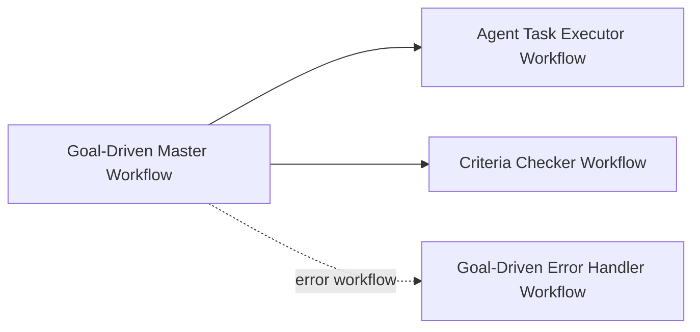

# IMPORT_ORDER

## 目标

这是一页版导入说明。  
如果你已经看过 README 和 Runbook，只想快速完成导入与接线，就照这一页执行。

## 1. 导入顺序

请按这个顺序导入：

```text
1. Agent Task Executor Workflow
2. Criteria Checker Workflow
3. Goal-Driven Error Handler Workflow
4. Goal-Driven Master Workflow
```

对应文件：

```text
workflows/agent_task_executor.workflow.json
workflows/criteria_checker.workflow.json
workflows/error_handler.workflow.json
workflows/goal_driven_master.workflow.json
```

## 2. 为什么这个顺序更好

- Executor 和 Checker 会先被准备好
- Master 后导入，便于你立即把它接到已经存在的子 workflow
- Error Handler 先存在，导入 Master 后就能直接在设置中指定

## 3. 接线完成后应该长这样



## 4. 你需要手动完成的 3 件事

### 4.1 Executor

把 Master 中与 executor 有关的调度占位，替换或接成真正的：

```text
Execute Sub-workflow → Agent Task Executor Workflow
```

### 4.2 Checker

把 Master 中与 checker 有关的调度占位，替换或接成真正的：

```text
Execute Sub-workflow → Criteria Checker Workflow
```

### 4.3 Error Handler

在 Master 的 workflow settings 里选择：

```text
Error workflow → Goal-Driven Error Handler Workflow
```

## 5. 导入后别急着做的事

先不要：

- 激活生产 workflow
- 接真实 LLM
- 删除 mock 节点
- 改 `max_iterations`

先让 sample payload 在你的 n8n 里跑通，再继续升级。

