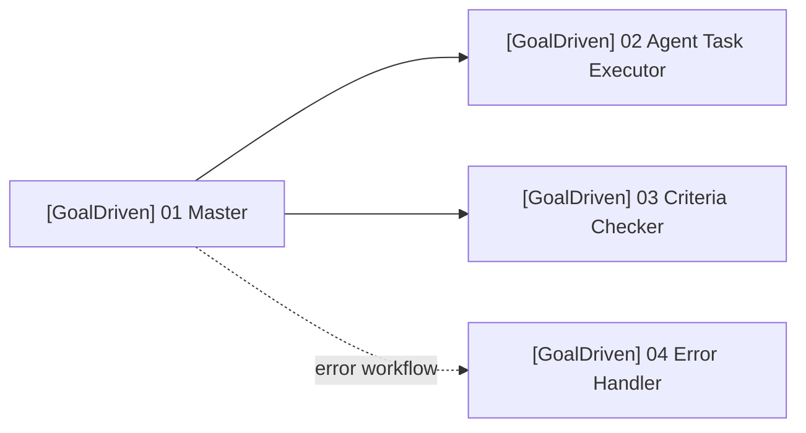

# IMPORT_ORDER

## 目标

这是一页版导入说明。  
如果你已经看过 README 和 Runbook，只想快速完成导入与接线，就照这一页执行。

## 1. 导入顺序

请按这个顺序导入：

```text
1. [GoalDriven] 02 Agent Task Executor
2. [GoalDriven] 03 Criteria Checker
3. [GoalDriven] 04 Error Handler
4. [GoalDriven] 01 Master
```

对应文件：

```text
workflows/agent_task_executor.workflow.json
workflows/criteria_checker.workflow.json
workflows/error_handler.workflow.json
workflows/goal_driven_master.workflow.json
```

## 2. 为什么这个顺序更好

- Executor 和 Checker 会先被准备好
- Master 后导入，便于你立即把它接到已经存在的子 workflow
- Error Handler 先存在，导入 Master 后就能直接在设置中指定

## 3. 接线完成后应该长这样



## 4. 导入后需要核对的 3 件事

### 4.1 Executor

当前仓库中的正式 JSON 已保留你在 n8n UI 中跑通的 `Execute Sub-workflow` 绑定。  
重新导入到**同一个 n8n 实例**时，通常可以继续沿用原有绑定；如果迁移到**另一台 n8n 实例**，需要在 Master 中重新选择：

```text
Execute Sub-workflow → [GoalDriven] 02 Agent Task Executor
```

### 4.2 Checker

同理，跨实例迁移时需要在 Master 中重新选择：

```text
Execute Sub-workflow → [GoalDriven] 03 Criteria Checker
```

### 4.3 Error Handler

在跨实例迁移后，重新在 Master 的 workflow settings 里选择：

```text
Error workflow → [GoalDriven] 04 Error Handler
```

## 5. 导入后别急着做的事

先不要：

- 激活生产 workflow
- 接真实 LLM
- 删除 mock 节点
- 改 `max_iterations`

先让 sample payload 在你的 n8n 里跑通，再继续升级。
