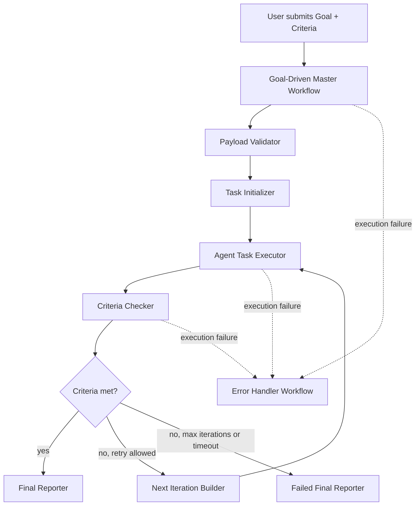

# WORKFLOW_DESIGN

## 1. 设计目标

正式 MVP 由四个协作 workflow 组成：

1. `goal_driven_master.workflow.json`
2. `agent_task_executor.workflow.json`
3. `criteria_checker.workflow.json`
4. `error_handler.workflow.json`

它们共同实现：

- 接收目标
- 调度执行
- 检查 criteria
- 继续下一轮或结束
- 捕获失败并输出恢复建议

## 2. 总体流程



## 3. Workflow 职责划分

### 3.1 Master Workflow

文件目标：

```text
workflows/goal_driven_master.workflow.json
```

职责：

| 节点 / 模块 | 作用 |
| --- | --- |
| Webhook Trigger | 接收用户提交的 `goal`、`criteria` 和限制参数 |
| Payload Validator | 校验输入完整性 |
| Task Initializer | 生成 `run_id`、`task_id`、初始状态 |
| Agent Dispatcher | 调用 Executor Workflow |
| Criteria Router | 根据 checker 结果决定完成、继续或失败 |
| Final Reporter | 生成最终报告 |
| Human Approval Gate | 在高风险任务上保留人工审核入口 |

### 3.2 Agent Task Executor Workflow

文件目标：

```text
workflows/agent_task_executor.workflow.json
```

职责：

| 节点 / 模块 | 作用 |
| --- | --- |
| Task Receiver | 接收来自 Master 的任务 |
| Prompt Builder | 组合 subagent prompt |
| Agent Adapter | 在 `mock` 与真实 provider 之间切换 |
| Result Normalizer | 输出结构化 `result` |
| Execution Logger | 记录本轮摘要 |

### 3.3 Criteria Checker Workflow

文件目标：

```text
workflows/criteria_checker.workflow.json
```

职责：

| 节点 / 模块 | 作用 |
| --- | --- |
| Goal Reader | 获取原始 goal |
| Criteria Reader | 获取 criteria |
| Result Reader | 获取本轮 Agent 产出 |
| Criteria Evaluator | 对每条 criterion 输出 pass / fail / evidence |
| Score Aggregator | 汇总整体得分 |
| Next Iteration Builder | 未达标时生成下一轮指令 |

### 3.4 Error Handler Workflow

文件目标：

```text
workflows/error_handler.workflow.json
```

职责：

| 节点 / 模块 | 作用 |
| --- | --- |
| Error Trigger | 接收失败执行 |
| Error Normalizer | 提取 workflow、节点、错误摘要 |
| Error Logger | 保存错误记录 |
| Recovery Advisor | 给出恢复建议 |
| User Notifier | 输出 Markdown 或通知信息 |

## 4. 关键状态流转

```text
initialized
  → dispatched
  → checking
  → needs_iteration
  → completed
```

异常状态：

```text
failed
timed_out
stopped_by_human
max_iterations_reached
```

## 5. 输入输出契约草案

### Master 输入

```json
{
  "goal": "string",
  "criteria": ["string"],
  "context": {},
  "max_iterations": 5,
  "timeout_minutes": 30,
  "require_human_approval": true,
  "risk_level": "low"
}
```

### Executor 输出

```json
{
  "run_id": "gd_example",
  "task_id": "string",
  "status": "completed",
  "summary": "string",
  "artifacts": ["string"],
  "known_issues": ["string"],
  "evidence": [
    {
      "criterion": "string",
      "status": "pass",
      "detail": "string"
    }
  ],
  "next_action_suggestion": "string",
  "error": null
}
```

### Checker 输出

```json
{
  "criteria_met": false,
  "score": 0.72,
  "checks": [
    {
      "criterion": "string",
      "status": "pass",
      "evidence": "string"
    }
  ],
  "next_iteration_instruction": "string"
}
```

## 6. 人工审核设计

以下情况应进入人工审核或人工确认：

- 任务被标记为高风险
- 涉及生产环境、凭据、删除、发布、外部通知
- 达到失败阈值但仍想继续
- 系统信心不足或证据不足

人工审核不是 MVP 的附属品，而是防止系统失控的必要边界。

## 7. 执行边界

默认建议：

```text
max_iterations <= 5
timeout_minutes <= 30
```

达到任一限制后，Master Workflow 必须停止继续派发任务，并转入最终报告生成。

## 8. 手动测试与生产运行

开发阶段应优先使用手动执行和 sample payload 验证逻辑。  
正式自动运行时，workflow 才应通过 webhook 或 schedule trigger 被触发，并在人工确认后启用生产模式。n8n 官方将单次 workflow 运行称为 execution，并区分手动执行与自动触发的生产执行；开发阶段保持 workflow 为 inactive 更安全。  

## 9. 错误处理

错误处理应由独立 workflow 承接，而不是把所有异常都堆进主流程。  
正式 `error_handler.workflow.json` 需要围绕 n8n 的 Error Trigger 设计，并输出：

- 出错 workflow
- 出错节点
- 错误摘要
- 输入摘要
- 推荐恢复动作

## 10. 当前原型与正式设计的关系

当前仓库中的：

```text
n8n/workflows/codex-planner-reviewer.workflow.json
```

属于过渡原型。它已经验证了：

- 输入归一化
- 风险守卫
- 人工审批闸门
- 结构化响应

正式 MVP 会吸收这些节点思想，但改造成更通用的 Goal-Driven 四 workflow 架构。

## 11. 后续阶段落地顺序

1. Phase 2：先固定 schema 与 prompt 契约
2. Phase 3：再生成正式 workflow JSON
3. Phase 4：用 mock mode 做本地测试
4. Phase 5：补 runbook、test cases 和最终报告样例

## 12. Phase 3 导出模板说明

当前仓库中的四个正式 workflow JSON 已经落地：

```text
workflows/goal_driven_master.workflow.json
workflows/agent_task_executor.workflow.json
workflows/criteria_checker.workflow.json
workflows/error_handler.workflow.json
```

### 12.1 当前实现边界

Phase 3 采用 **mock-first** 设计：

- `Goal-Driven Master Workflow`
  - 接收 goal
  - 校验 payload
  - 生成 `run_id / task_id`
  - 体现 executor 与 checker 的调度关系
  - 在 mock 模式下返回一次 orchestration turn 的结果
- `Agent Task Executor Workflow`
  - 通过 `When Executed by Another Workflow` 触发
  - 校验 task payload
  - 返回结构化 mock result
- `Criteria Checker Workflow`
  - 通过 `When Executed by Another Workflow` 触发
  - 基于 evidence 逐项输出 pass / fail / unknown
- `Goal-Driven Error Handler Workflow`
  - 通过 `Error Trigger` 接收失败执行
  - 输出错误摘要和恢复建议

### 12.2 导入后的人工检查项

不同 n8n 实例导入后会生成不同 workflow ID，因此当前模板不会硬编码生产 ID。  
导入后应在 n8n UI 中人工完成：

1. 将 Master 中的 executor 调度占位替换或接成真正的 `Execute Sub-workflow` 调用，并指向 `Agent Task Executor Workflow`
2. 将 Master 中的 checker 调度占位替换或接成真正的 `Execute Sub-workflow` 调用，并指向 `Criteria Checker Workflow`
3. 将 `Goal-Driven Error Handler Workflow` 设置为 Master 的 error workflow
4. 先用 sample payload 手动执行，再决定是否激活

### 12.3 为什么先 mock

先让输入、输出、分支和失败路径稳定，再接真实 provider。  
这能把“workflow 是否正确”与“模型是否聪明”分开验证，降低 Phase 4 / Phase 5 的调试成本。
