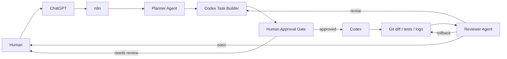

# Agent 工作流架构说明

## 1. 总体架构

这一版的目标不是让 Agent 自由奔跑，而是先建立一个**可追踪、可审查、可回滚**的安全闭环。

参与角色：

- **Human**：提出目标、确认高风险动作、决定是否激活或合并
- **ChatGPT**：帮助澄清目标、拆解问题、审查方案
- **n8n**：负责任务编排、状态流转、Webhook 接入
- **Planner Agent**：把目标拆成可执行计划
- **Codex Task Builder**：把计划转成 Codex 可消费的任务说明
- **Codex**：执行代码修改
- **Git**：保存 diff、提交历史和回滚锚点
- **Reviewer Agent**：根据验收标准审查结果
- **Human Approval Gate**：在中高风险任务前保留人工闸门

## 2. 数据流说明

### 输入

Webhook 第一版接收：

- `projectName`
- `goal`
- `repoPath`
- `branchName`
- `constraints`
- `acceptanceCriteria`
- `maxIterations`
- `mode`

### 中间产物

- `riskLevel`
- `taskBreakdown`
- `implementationPlan`
- `validationPlan`
- `rollbackPlan`
- `codexTaskPrompt`
- `gitDiffSummary`
- `testResults`
- `changedFiles`
- `review`

### 输出

- `status`
- `riskLevel`
- `codexTaskPrompt`
- `review`
- `nextAction`
- `warnings`

## 3. 每个 Agent 的职责边界

### Planner Agent

负责：

- 理解目标
- 拆解任务
- 提出验证与回滚方案

不负责：

- 直接改代码
- 直接部署
- 绕过人工审批

### Codex Task Builder

负责：

- 把计划整理成 Codex 可执行的结构化任务
- 明确禁止事项、验收标准、测试动作、提交建议

不负责：

- 假设 Codex 一定存在官方 API
- 自动执行生产动作

### Codex

负责：

- 在仓库中完成代码修改
- 输出 diff、测试结果和说明

不负责：

- 自行突破范围
- 自行提交密钥
- 自行激活线上流程

### Reviewer Agent

负责：

- 对照验收标准审查结果
- 给出分数、问题、下一步建议

不负责：

- 替代最终的人类判断
- 在证据不足时假装通过

### Human Approval Gate

负责：

- 阻断中高风险任务的自动执行
- 给人类保留最后确认权

## 4. 为什么第一阶段不建议直接操作 n8n UI

直接在 UI 里“点出来”的 workflow 很容易遇到几个问题：

- 变更不可审查
- 很难做版本比对
- 容易把临时凭据或调试配置留在线上
- 出问题时缺少清晰回滚点
- 多人协作时很难知道谁改了什么

所以第一阶段更适合先把 workflow JSON、脚本和文档纳入 Git，再决定何时导入、何时激活。

## 5. 为什么要把 workflow JSON 纳入 Git

把 workflow 当代码管理，可以获得：

- 可审查：每次改动都能看 diff
- 可回滚：出错时能恢复旧版本
- 可复现：不同环境可导入同一份定义
- 可协作：Agent、人类、未来的 CI 都能围绕同一份源文件工作
- 可治理：安全检查、密钥扫描、dry-run 都能在提交前完成

## 6. 未来如何扩展

后续可以在当前骨架上逐步增加：

1. **GitHub Issue 队列**
   - 每个 Codex 任务落成 issue
   - 方便排序、追踪和人工接管

2. **Pull Request 审查**
   - 自动采集 PR diff、review comment、CI 结果

3. **测试结果采集**
   - 从 CI、日志或本地执行结果中回填 `testResults`

4. **自动生成下一轮 Codex 任务**
   - Reviewer Agent 输出 `nextCodexTaskPrompt`

5. **接入 RAG 项目上下文**
   - 为 Planner / Reviewer 提供历史设计文档、架构约束、失败案例

6. **接入日志和评估指标**
   - 记录每轮耗时、通过率、返工率、人工介入率

## 7. 本阶段设计取舍

当前版本刻意保持克制：

- 不直接连接生产 n8n
- 不直接调用不存在的 Codex API
- 不把 Agent 变成无人监管的执行者
- 优先把“结构、安全、回滚”打牢

这能让你后续继续扩展，而不是先得到一个难以维护的自动化黑盒。

